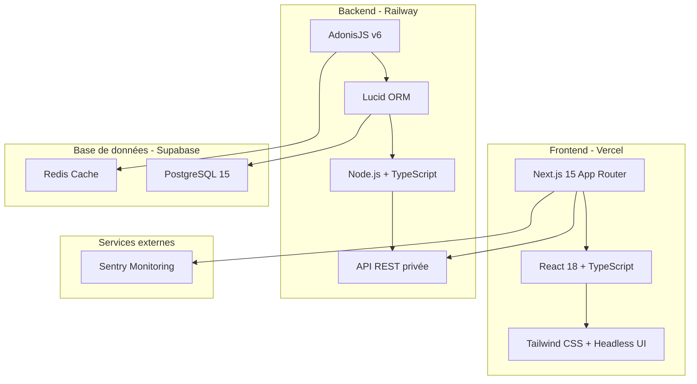
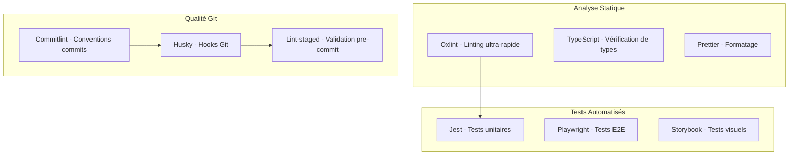

# DevBook - RPM-CL (Partner Relationship Management - Cabinet Laurent)

> **Guide technique complet pour le développement de l'application de gestion des relations partenaires**

## Table des matières

1. [Vue d'ensemble du projet](#1-vue-densemble-du-projet)
2. [Architecture technique détaillée](#2-architecture-technique-détaillée)
3. [Guide de mise en place](#3-guide-de-mise-en-place)
4. [Structure des projets](#4-structure-des-projets)
5. [Guide de développement](#5-guide-de-développement)
6. [Documentation API](#6-documentation-api)
7. [Base de données](#7-base-de-données)
8. [Tests et qualité](#8-tests-et-qualité)
9. [Sécurité et RGPD](#9-sécurité-et-rgpd)
10. [Déploiement et production](#10-déploiement-et-production)

---

## 1. Vue d'ensemble du projet

### 1.1. Contexte métier et objectifs

**RPM-CL** est une application web de **gestion des relations partenaires (PRM)** développée spécifiquement pour structurer, suivre et optimiser les contacts professionnels du cabinet Laurent.

#### Objectifs principaux :

- **Organiser efficacement** les partenaires professionnels
- **Retrouver rapidement** les bons contacts selon différents critères
- **Suivre l'historique** des recommandations et des mises en relation
- **Améliorer la qualité** du réseau et la stratégie de cross-selling/up-selling

#### Valeur ajoutée :

- **Gain de temps** : Recherche et filtrage avancés
- **Professionnalisme** : Interface épurée et mobile-first
- **Sécurité** : Conformité RGPD stricte avec audit trail
- **Évolutivité** : Architecture modulaire et scalable

### 1.2. Périmètre fonctionnel MVP

#### Fonctionnalités principales :

- ✅ **Gestion des fiches partenaires** : création, modification, archivage, notation (1-5 étoiles)
- ✅ **Recherche et filtres avancés** : par métier, nom, notation, statut
- ✅ **Classifications hiérarchiques** : métiers, sous-métiers, tags
- ✅ **Actions rapides** : appel direct, email
- ✅ **Historique des recommandations** : clients envoyés/reçus
- ✅ **Interface mobile-first** : optimisée pour la saisie rapide

#### Spécialités métiers supportées :

- Avocats d'affaires, Fiscalistes, Spécialistes droit du travail
- Huissiers de justice, Banques, Compagnies d'affacturage
- Assureurs, Cabinets de gestion de patrimoine
- Experts en gestion de paie & RH, Cabinets de recrutement, Notaires

### 1.3. Contraintes et exigences

#### Contraintes techniques :

- **Compatibilité** : Chrome, Firefox, Edge (desktop) + Chrome, Firefox (mobile)
- **Performance** : Temps de chargement < 2s, First Contentful Paint < 1.2s
- **Éco-conception** : < 1g CO2 par page vue, bundle < 150kb
- **Accessibilité** : Conformité WCAG, navigation clavier, contrastes

#### Contraintes réglementaires :

- **RGPD** : Chiffrement, droit à l'oubli, consentement explicite
- **Audit trail** : Traçabilité complète des actions sensibles
- **Authentification** : Gestion des sessions sécurisées

---

## 2. Architecture technique détaillée

### 2.1. Stack technologique

#### Vue d'ensemble de l'architecture



#### Justifications des choix techniques

| Composant           | Technologie               | Justification                                           |
| ------------------- | ------------------------- | ------------------------------------------------------- |
| **Frontend**        | Next.js 15                | App Router, RSC, optimisations natives, SSR/CSR hybride |
| **Backend**         | AdonisJS v6               | TypeScript natif, ORM Lucid, architecture MVC robuste   |
| **Base de données** | PostgreSQL                | Recherches complexes, relations, performance, ACID      |
| **Cache**           | Redis                     | Sessions, cache API, performance temps réel             |
| **Hébergement**     | Vercel + Railway          | Edge computing, scaling auto, CI/CD intégré             |
| **Monitoring**      | Sentry + Vercel Analytics | Debugging production, métriques temps réel              |

### 2.2. Architecture par features

#### Principe d'organisation

```
/features
├── partners/          # Gestion des partenaires
├── users/            # Gestion des utilisateurs
├── classifications/  # Métiers, sous-métiers, tags
├── notifications/    # Système de notifications
├── stats/           # Statistiques et analytics
├── auth/            # Authentification utilisateur
└── shared/          # Composants transverses
```

#### Avantages de cette approche :

- **Isolation** : Chaque feature est autonome
- **Maintenabilité** : Refactoring facilité
- **Tests** : Tests au plus près du code métier
- **Onboarding** : Structure claire pour nouveaux développeurs

### 2.3. Optimisations performance et éco-conception

#### Configuration Next.js optimisée

```typescript
// next.config.js
const nextConfig = {
  // Optimisation images automatique
  images: {
    formats: ['image/avif', 'image/webp'],
    minimumCacheTTL: 31536000,
  },
  // Compression maximale
  compress: true,
  // Tree shaking agressif
  experimental: {
    optimizePackageImports: ['@heroicons/react', 'lucide-react'],
    serverComponentsExternalPackages: ['@prisma/client'],
  },
  // Hybrid SSR/CSR pour performance
  hybridRendering: true,
}
```

#### Stratégie de cache multi-niveaux

```typescript
const cacheStrategy = {
  // Browser cache
  'static-assets': '1y',
  'api-responses': '5m',

  // CDN cache (Vercel Edge)
  'partner-list': '1h',
  classifications: '24h',

  // Server cache (Redis)
  'search-results': '15m',
  'user-session': '30m',
}
```

#### Métriques éco-responsabilité cibles

- **Empreinte carbone** : < 1g CO2 par page vue
- **Transfer de données** : < 2MB par session
- **Cache hit ratio** : > 85%
- **Optimisation images** : > 90% WebP/AVIF

---

## 3. Guide de mise en place

### 3.1. Prérequis système

#### Outils requis

```fish
# Node.js et gestionnaire de paquets
node --version  # >= 18.17.0
npm --version   # >= 9.0.0
# ou
bun --version   # >= 1.0.0 (recommandé pour performance)

# Base de données
psql --version  # PostgreSQL >= 15
redis-server --version  # Redis >= 7.0

# Outils de développement
git --version
docker --version  # Optionnel pour conteneurisation
```

#### Services externes requis

- **Compte Vercel** : Hébergement frontend
- **Compte Railway** : Hébergement backend
- **Compte Supabase** : Base de données managée
- **Sentry** : Monitoring erreurs

### 3.2. Installation complète du projet

#### 1. Clonage et setup initial

```fish
# Cloner le repository
git clone https://github.com/cabinet-laurent/rpm-cl.git
cd rpm-cl

# Installation des dépendances
bun install

# Setup des workspaces
bun install --workspaces
```

#### 2. Configuration des variables d'environnement

**Frontend (.env.local)**

```bash
# Authentication
NEXTAUTH_URL=http://localhost:3000
NEXTAUTH_SECRET=your-super-secret-key

# API Backend
NEXT_PUBLIC_API_URL=http://localhost:3333/api
NEXT_PUBLIC_APP_ENV=development

# Monitoring
NEXT_PUBLIC_SENTRY_DSN=your-sentry-dsn
NEXT_PUBLIC_VERCEL_ANALYTICS_ID=your-vercel-analytics-id
```

**Backend (.env)**

```bash
# Application
NODE_ENV=development
PORT=3333
APP_KEY=your-app-key-32-characters-long
HOST=0.0.0.0

# Database
DB_CONNECTION=pg
PG_HOST=localhost
PG_PORT=5432
PG_USER=rpm_user
PG_PASSWORD=rpm_password
PG_DB_NAME=rpm_development

# Redis Cache
REDIS_CONNECTION=local
REDIS_HOST=127.0.0.1
REDIS_PORT=6379
REDIS_PASSWORD=

# Security
SESSION_DRIVER=redis
HASH_DRIVER=bcrypt
```

#### 3. Setup base de données

```fish
# Démarrer PostgreSQL et Redis
sudo service postgresql start
sudo service redis-server start

# Créer la base de données
createdb rpm_development
createdb rpm_test

# Migrations et seeds
cd backend
node ace migration:run
node ace db:seed
```

#### 4. Démarrage en mode développement

```fish
# Terminal 1 - Backend AdonisJS
cd backend
bun run dev

# Terminal 2 - Frontend Next.js
cd frontend
bun run dev

# Terminal 3 - Tests en mode watch
bun run test:watch
```

### 3.3. Configuration Docker (optionnelle)

#### docker-compose.yml

```yaml
version: '3.8'
services:
  # Base de données
  postgres:
    image: postgres:15-alpine
    environment:
      POSTGRES_USER: rpm_user
      POSTGRES_PASSWORD: rpm_password
      POSTGRES_DB: rpm_development
    ports:
      - '5432:5432'
    volumes:
      - postgres_data:/var/lib/postgresql/data

  # Cache Redis
  redis:
    image: redis:7-alpine
    ports:
      - '6379:6379'
    volumes:
      - redis_data:/data

  # Backend AdonisJS
  backend:
    build: ./backend
    ports:
      - '3333:3333'
    depends_on:
      - postgres
      - redis
    environment:
      - NODE_ENV=development
    volumes:
      - ./backend:/app
      - /app/node_modules

  # Frontend Next.js
  frontend:
    build: ./frontend
    ports:
      - '3000:3000'
    depends_on:
      - backend
    environment:
      - NODE_ENV=development
    volumes:
      - ./frontend:/app
      - /app/node_modules

volumes:
  postgres_data:
  redis_data:
```

#### Commandes Docker

```fish
# Démarrer tous les services
docker-compose up -d

# Logs en temps réel
docker-compose logs -f

# Arrêter les services
docker-compose down

# Reset complet
docker-compose down -v
docker-compose up --build
```

---

## 4. Structure des projets

### 4.1. Organisation globale du monorepo

```
rpm-cl/
├── frontend/                 # Next.js 15 Application
├── backend/                  # AdonisJS v6 API
├── shared/                   # Types et utilitaires partagés
├── docs/                     # Documentation projet
├── .github/                  # CI/CD GitHub Actions
├── docker-compose.yml        # Environnement de développement
├── package.json              # Workspace root
└── README.md
```

### 4.2. Structure Frontend (Next.js 15)

```
frontend/
├── public/                   # Assets statiques
│   ├── icons/               # Icônes application
│   ├── images/              # Images optimisées
│   └── robots.txt
├── src/
│   ├── app/                 # App Router Next.js 15
│   │   ├── (auth)/          # Route group authentication
│   │   │   ├── login/
│   │   │   └── register/
│   │   ├── (dashboard)/     # Route group application
│   │   │   ├── partners/
│   │   │   ├── stats/
│   │   │   └── settings/
│   │   ├── api/             # API Routes Next.js
│   │   ├── globals.css      # Styles globaux
│   │   ├── layout.tsx       # Layout racine
│   │   └── page.tsx         # Page d'accueil
│   ├── features/            # Architecture par features
│   │   ├── partners/
│   │   │   ├── components/  # Composants UI spécifiques
│   │   │   │   ├── PartnerCard.tsx
│   │   │   │   ├── PartnerForm.tsx
│   │   │   │   ├── PartnerList.tsx
│   │   │   │   └── index.ts
│   │   │   ├── hooks/       # Hooks React spécifiques
│   │   │   │   ├── usePartners.ts
│   │   │   │   ├── usePartnerForm.ts
│   │   │   │   └── index.ts
│   │   │   ├── services/    # API calls et logique métier
│   │   │   │   ├── partnerApi.ts
│   │   │   │   ├── partnerValidation.ts
│   │   │   │   └── index.ts
│   │   │   ├── types/       # Types TypeScript spécifiques
│   │   │   │   ├── Partner.ts
│   │   │   │   ├── PartnerForm.ts
│   │   │   │   └── index.ts
│   │   │   └── __tests__/   # Tests unitaires feature
│   │   │       ├── components/
│   │   │       ├── hooks/
│   │   │       └── services/
│   │   ├── users/
│   │   ├── classifications/
│   │   ├── notifications/
│   │   ├── stats/
│   │   └── auth/
│   ├── shared/              # Composants et utils réutilisables
│   │   ├── components/      # Composants UI transverses
│   │   │   ├── ui/          # Composants base (Button, Input, etc.)
│   │   │   ├── layout/      # Composants layout (Header, Sidebar)
│   │   │   ├── forms/       # Composants formulaires
│   │   │   └── feedback/    # Toasts, modales, alerts
│   │   ├── hooks/           # Hooks React globaux
│   │   │   ├── useAuth.ts
│   │   │   ├── useApi.ts
│   │   │   └── useLocalStorage.ts
│   │   ├── utils/           # Utilitaires transverses
│   │   │   ├── api.ts
│   │   │   ├── validation.ts
│   │   │   ├── formatting.ts
│   │   │   └── constants.ts
│   │   ├── types/           # Types globaux
│   │   │   ├── api.ts
│   │   │   ├── auth.ts
│   │   │   └── common.ts
│   │   └── styles/          # Styles partagés
│   │       ├── components.css
│   │       └── utilities.css
│   ├── contexts/            # React Contexts
│   │   ├── AuthContext.tsx
│   │   ├── ThemeContext.tsx
│   │   └── NotificationContext.tsx
│   └── middleware.ts        # Middleware Next.js
├── e2e/                     # Tests end-to-end Playwright
│   ├── tests/
│   │   ├── auth.spec.ts
│   │   ├── partners.spec.ts
│   │   └── search.spec.ts
│   ├── fixtures/
│   └── playwright.config.ts
├── .env.local               # Variables d'environnement
├── oxlint.json              # Configuration Oxlint
├── .prettierrc              # Configuration Prettier
├── next.config.js           # Configuration Next.js
├── tailwind.config.js       # Configuration Tailwind
├── tsconfig.json            # Configuration TypeScript
├── jest.config.js           # Configuration Jest
└── package.json
```

#### Exemple de composant Partner avec architecture par feature

**`src/features/partners/components/PartnerCard.tsx`**

```tsx
import { type FC } from 'react'
import { Phone, Mail, Star, Archive, AlertTriangle } from 'lucide-react'
import { Button } from '@/components/ui/button'
import { type Partner } from '../types'

interface PartnerCardProps {
  partner: Partner
  onEdit: (id: string) => void
  onArchive: (id: string) => void
  onCall: (phone: string) => void
  onEmail: (email: string) => void
}

export const PartnerCard: FC<PartnerCardProps> = ({
  partner,
  onEdit,
  onArchive,
  onCall,
  onEmail,
}) => {
  const {
    id,
    firstName,
    lastName,
    email,
    phone,
    company,
    rating,
    isBlacklisted,
    classifications,
  } = partner

  return (
    <div className='bg-white rounded-lg shadow-sm border p-6 hover:shadow-md transition-shadow'>
      {/* Header */}
      <div className='flex justify-between items-start mb-4'>
        <div>
          <h3 className='text-lg font-semibold text-gray-900'>
            {firstName} {lastName}
          </h3>
          <p className='text-sm text-gray-600'>{company}</p>
        </div>

        {/* Status badges */}
        <div className='flex gap-2'>
          {isBlacklisted && (
            <Badge variant='destructive' className='flex items-center gap-1'>
              <AlertTriangle className='w-3 h-3' />
              Blacklisté
            </Badge>
          )}
          {rating && (
            <div className='flex items-center gap-1'>
              {Array.from({ length: 5 }, (_, i) => (
                <Star
                  key={i}
                  className={`w-4 h-4 ${
                    i < rating
                      ? 'text-yellow-400 fill-current'
                      : 'text-gray-300'
                  }`}
                />
              ))}
            </div>
          )}
        </div>
      </div>

      {/* Classifications */}
      {classifications && classifications.length > 0 && (
        <div className='flex flex-wrap gap-2 mb-4'>
          {classifications.map(classification => (
            <Badge key={classification.id} variant='secondary'>
              {classification.name}
            </Badge>
          ))}
        </div>
      )}

      {/* Actions */}
      <div className='flex justify-between items-center'>
        <div className='flex gap-2'>
          {phone && (
            <Button
              variant='outline'
              size='sm'
              onClick={() => onCall(phone)}
              className='flex items-center gap-1'
            >
              <Phone className='w-4 h-4' />
              Appeler
            </Button>
          )}
          {email && (
            <Button
              variant='outline'
              size='sm'
              onClick={() => onEmail(email)}
              className='flex items-center gap-1'
            >
              <Mail className='w-4 h-4' />
              Email
            </Button>
          )}
        </div>

        <div className='flex gap-2'>
          <Button variant='ghost' size='sm' onClick={() => onEdit(id)}>
            Modifier
          </Button>
          <Button
            variant='ghost'
            size='sm'
            onClick={() => onArchive(id)}
            className='text-red-600 hover:text-red-700'
          >
            <Archive className='w-4 h-4' />
          </Button>
        </div>
      </div>
    </div>
  )
}
```

**`src/features/partners/hooks/usePartners.ts`**

```tsx
import { useQuery, useMutation, useQueryClient } from '@tanstack/react-query'
import { partnerApi } from '../services/partnerApi'
import { type Partner, type PartnerFilters } from '../types'

export const usePartners = (filters?: PartnerFilters) => {
  return useQuery({
    queryKey: ['partners', filters],
    queryFn: () => partnerApi.getAll(filters),
    staleTime: 5 * 60 * 1000, // 5 minutes
  })
}

export const usePartner = (id: string) => {
  return useQuery({
    queryKey: ['partner', id],
    queryFn: () => partnerApi.getById(id),
    enabled: !!id,
  })
}

export const useCreatePartner = () => {
  const queryClient = useQueryClient()

  return useMutation({
    mutationFn: partnerApi.create,
    onSuccess: () => {
      queryClient.invalidateQueries({ queryKey: ['partners'] })
    },
  })
}

export const useUpdatePartner = () => {
  const queryClient = useQueryClient()

  return useMutation({
    mutationFn: ({ id, data }: { id: string; data: Partial<Partner> }) =>
      partnerApi.update(id, data),
    onSuccess: (_, { id }) => {
      queryClient.invalidateQueries({ queryKey: ['partners'] })
      queryClient.invalidateQueries({ queryKey: ['partner', id] })
    },
  })
}

export const useArchivePartner = () => {
  const queryClient = useQueryClient()

  return useMutation({
    mutationFn: partnerApi.archive,
    onSuccess: () => {
      queryClient.invalidateQueries({ queryKey: ['partners'] })
    },
  })
}
```

### 4.3. Structure Backend (AdonisJS v6)

```
backend/
├── app/
│   ├── features/            # Architecture par features
│   │   ├── partners/
│   │   │   ├── controllers/ # Contrôleurs HTTP
│   │   │   │   ├── PartnerController.ts
│   │   │   │   └── PartnerSearchController.ts
│   │   │   ├── services/    # Services métier
│   │   │   │   ├── PartnerService.ts
│   │   │   │   ├── PartnerSearchService.ts
│   │   │   │   └── PartnerValidationService.ts
│   │   │   ├── validators/  # Validation des requêtes
│   │   │   │   ├── CreatePartnerValidator.ts
│   │   │   │   ├── UpdatePartnerValidator.ts
│   │   │   │   └── SearchPartnerValidator.ts
│   │   │   ├── models/      # Modèles ORM
│   │   │   │   ├── Partner.ts
│   │   │   │   └── PartnerClassification.ts
│   │   │   ├── policies/    # Politiques d'autorisation
│   │   │   │   └── PartnerPolicy.ts
│   │   │   ├── jobs/        # Jobs asynchrones
│   │   │   └── __tests__/   # Tests feature
│   │   │       ├── controllers/
│   │   │       ├── services/
│   │   │       └── models/
│   │   ├── users/
│   │   ├── classifications/
│   │   ├── notifications/
│   │   ├── auth/
│   │   └── stats/
│   ├── shared/              # Éléments transverses
│   │   ├── middleware/      # Middlewares globaux
│   │   │   ├── AuthMiddleware.ts
│   │   │   └── AuditMiddleware.ts
│   │   ├── exceptions/      # Exceptions personnalisées
│   │   │   ├── BusinessException.ts
│   │   │   ├── ValidationException.ts
│   │   │   └── AuthorizationException.ts
│   │   ├── helpers/         # Utilitaires
│   │   │   ├── encryption.ts
│   │   │   ├── audit.ts
│   │   │   └── validation.ts
│   │   ├── contracts/       # Interfaces globales
│   │   │   ├── auth.ts
│   │   │   ├── pagination.ts
│   │   │   └── audit.ts
│   │   └── services/        # Services transverses
│   │       ├── EmailService.ts
│   │       ├── CacheService.ts
│   │       └── AuditService.ts
│   └── Models/              # Modèles base Adonis
├── config/                  # Configuration Adonis
│   ├── app.ts
│   ├── database.ts
│   ├── cors.ts
│   └── auth.ts
├── database/
│   ├── migrations/          # Migrations base de données
│   │   ├── 001_create_users_table.ts
│   │   ├── 002_create_partners_table.ts
│   │   ├── 003_create_classifications_table.ts
│   │   └── 004_create_audit_trails_table.ts
│   ├── seeders/            # Données de test
│   │   ├── UserSeeder.ts
│   │   ├── ClassificationSeeder.ts
│   │   └── PartnerSeeder.ts
│   └── factories/          # Factories pour tests
│       ├── UserFactory.ts
│       ├── PartnerFactory.ts
│       └── ClassificationFactory.ts
├── start/
│   ├── routes/             # Définition des routes
│   │   ├── api.ts          # Routes API principales
│   │   ├── auth.ts         # Routes authentification
│   │   └── webhooks.ts     # Webhooks externes
│   ├── kernel.ts           # Configuration noyau
│   └── env.ts              # Validation variables d'environnement
├── tests/                  # Tests globaux et E2E
├── .env                    # Variables d'environnement
├── .adonisrc.json          # Configuration Adonis
├── tsconfig.json           # Configuration TypeScript
├── package.json
└── ace                     # CLI Adonis
```

#### Exemple de contrôleur Partner avec architecture par feature

**`app/features/partners/controllers/PartnerController.ts`**

```typescript
import type { HttpContext } from '@adonisjs/core/http'
import { inject } from '@adonisjs/core'
import { PartnerService } from '../services/PartnerService'
import { CreatePartnerValidator, UpdatePartnerValidator } from '../validators'

@inject()
export default class PartnerController {
  constructor(private partnerService: PartnerService) {}

  /**
   * GET /api/partners
   * Liste des partenaires avec filtres et pagination
   */
  public async index({ request, response, auth }: HttpContext) {
    try {
      const user = auth.user!
      const filters = request.qs()
      const page = request.input('page', 1)
      const limit = request.input('limit', 20)

      const partners = await this.partnerService.paginate(
        { page, limit },
        filters,
        user
      )

      return response.ok({
        data: partners.data,
        meta: {
          total: partners.total,
          page: partners.currentPage,
          limit: partners.perPage,
          lastPage: partners.lastPage,
        },
      })
    } catch (error) {
      return response.internalServerError({
        message: 'Erreur lors de la récupération des partenaires',
        error: error.message,
      })
    }
  }

  /**
   * GET /api/partners/:id
   * Détail d'un partenaire
   */
  public async show({ params, response, auth }: HttpContext) {
    try {
      const user = auth.user!
      const partner = await this.partnerService.findById(params.id, user)

      if (!partner) {
        return response.notFound({
          message: 'Partenaire non trouvé',
        })
      }

      return response.ok({ data: partner })
    } catch (error) {
      return response.internalServerError({
        message: 'Erreur lors de la récupération du partenaire',
        error: error.message,
      })
    }
  }

  /**
   * POST /api/partners
   * Création d'un nouveau partenaire
   */
  public async store({ request, response, auth }: HttpContext) {
    try {
      const user = auth.user!
      const payload = await request.validateUsing(CreatePartnerValidator)

      const partner = await this.partnerService.create(payload, user)

      return response.created({
        message: 'Partenaire créé avec succès',
        data: partner,
      })
    } catch (error) {
      if (error.code === 'E_VALIDATION_ERROR') {
        return response.badRequest({
          message: 'Données invalides',
          errors: error.messages,
        })
      }

      return response.internalServerError({
        message: 'Erreur lors de la création du partenaire',
        error: error.message,
      })
    }
  }

  /**
   * PUT /api/partners/:id
   * Mise à jour d'un partenaire
   */
  public async update({ params, request, response, auth }: HttpContext) {
    try {
      const user = auth.user!
      const payload = await request.validateUsing(UpdatePartnerValidator)

      const partner = await this.partnerService.update(params.id, payload, user)

      if (!partner) {
        return response.notFound({
          message: 'Partenaire non trouvé',
        })
      }

      return response.ok({
        message: 'Partenaire mis à jour avec succès',
        data: partner,
      })
    } catch (error) {
      if (error.code === 'E_VALIDATION_ERROR') {
        return response.badRequest({
          message: 'Données invalides',
          errors: error.messages,
        })
      }

      return response.internalServerError({
        message: 'Erreur lors de la mise à jour du partenaire',
        error: error.message,
      })
    }
  }

  /**
   * PUT /api/partners/:id/archive
   * Archivage d'un partenaire (soft delete)
   */
  public async archive({ params, response, auth }: HttpContext) {
    try {
      const user = auth.user!
      const success = await this.partnerService.archive(params.id, user)

      if (!success) {
        return response.notFound({
          message: 'Partenaire non trouvé',
        })
      }

      return response.ok({
        message: 'Partenaire archivé avec succès',
      })
    } catch (error) {
      return response.internalServerError({
        message: "Erreur lors de l'archivage du partenaire",
        error: error.message,
      })
    }
  }
}
```

**`app/features/partners/services/PartnerService.ts`**

```typescript
import { inject } from '@adonisjs/core'
import Partner from '../models/Partner'
import Classification from '../../classifications/models/Classification'
import { AuditService } from '../../../shared/services/AuditService'
import type {
  CreatePartnerData,
  UpdatePartnerData,
  PartnerFilters,
} from '../types'
import type User from '../../users/models/User'

@inject()
export class PartnerService {
  constructor(private auditService: AuditService) {}

  /**
   * Recherche paginée des partenaires avec filtres
   */
  public async paginate(
    pagination: { page: number; limit: number },
    filters: PartnerFilters,
    user: User
  ) {
    const query = Partner.query()
      .preload('classifications')
      .preload('createdBy')
      .where('isArchived', false) // Exclure les partenaires archivés par défaut

    // Appliquer les filtres
    if (filters.search) {
      query.where(subQuery => {
        subQuery
          .whereILike('firstName', `%${filters.search}%`)
          .orWhereILike('lastName', `%${filters.search}%`)
          .orWhereILike('company', `%${filters.search}%`)
          .orWhereILike('email', `%${filters.search}%`)
      })
    }

    if (filters.classification) {
      query.whereHas('classifications', classificationQuery => {
        classificationQuery.where('id', filters.classification)
      })
    }

    if (filters.rating) {
      query.where('rating', filters.rating)
    }

    if (filters.isBlacklisted !== undefined) {
      query.where('isBlacklisted', filters.isBlacklisted)
    }

    // Tri par défaut : nom, prénom
    query.orderBy('lastName', 'asc').orderBy('firstName', 'asc')

    const partners = await query.paginate(pagination.page, pagination.limit)

    // Audit de la consultation
    await this.auditService.log(
      user.id,
      'PARTNER_LIST_VIEWED',
      'Partner',
      null,
      {
        filters,
        resultCount: partners.total,
      }
    )

    return partners
  }

  /**
   * Trouver un partenaire par ID
   */
  public async findById(id: string, user: User): Promise<Partner | null> {
    const partner = await Partner.query()
      .where('id', id)
      .where('isArchived', false)
      .preload('classifications')
      .preload('recommendations')
      .preload('createdBy')
      .first()

    if (partner) {
      // Audit de la consultation
      await this.auditService.log(user.id, 'PARTNER_VIEWED', 'Partner', id, {
        partnerName: `${partner.firstName} ${partner.lastName}`,
      })
    }

    return partner
  }

  /**
   * Créer un nouveau partenaire
   */
  public async create(data: CreatePartnerData, user: User): Promise<Partner> {
    const partner = await Partner.create({
      ...data,
      createdById: user.id,
    })

    // Associer les classifications si fournies
    if (data.classificationIds && data.classificationIds.length > 0) {
      await partner.related('classifications').sync(data.classificationIds)
    }

    // Recharger avec les relations
    await partner.load('classifications')
    await partner.load('createdBy')

    // Audit de la création
    await this.auditService.log(
      user.id,
      'PARTNER_CREATED',
      'Partner',
      partner.id,
      {
        partnerData: {
          name: `${partner.firstName} ${partner.lastName}`,
          company: partner.company,
          email: partner.email,
        },
      }
    )

    return partner
  }

  /**
   * Mettre à jour un partenaire
   */
  public async update(
    id: string,
    data: UpdatePartnerData,
    user: User
  ): Promise<Partner | null> {
    const partner = await Partner.find(id)

    if (!partner || partner.isArchived) {
      return null
    }

    const oldData = partner.toJSON()

    // Mise à jour des données principales
    partner.merge(data)
    await partner.save()

    // Mise à jour des classifications si fournies
    if (data.classificationIds !== undefined) {
      await partner.related('classifications').sync(data.classificationIds)
    }

    // Recharger avec les relations
    await partner.load('classifications')

    // Audit de la modification
    await this.auditService.log(
      user.id,
      'PARTNER_UPDATED',
      'Partner',
      partner.id,
      {
        oldData,
        newData: partner.toJSON(),
        changes: this.getChangedFields(oldData, partner.toJSON()),
      }
    )

    return partner
  }

  /**
   * Archiver un partenaire (soft delete)
   */
  public async archive(id: string, user: User): Promise<boolean> {
    const partner = await Partner.find(id)

    if (!partner || partner.isArchived) {
      return false
    }

    partner.isArchived = true
    partner.archivedAt = new Date()
    await partner.save()

    // Audit de l'archivage
    await this.auditService.log(
      user.id,
      'PARTNER_ARCHIVED',
      'Partner',
      partner.id,
      {
        partnerData: {
          name: `${partner.firstName} ${partner.lastName}`,
          company: partner.company,
        },
      }
    )

    return true
  }

  /**
   * Utilitaire pour identifier les champs modifiés
   */
  private getChangedFields(oldData: any, newData: any): string[] {
    const changes: string[] = []
    const fieldsToCheck = [
      'firstName',
      'lastName',
      'email',
      'phone',
      'company',
      'rating',
      'isBlacklisted',
    ]

    fieldsToCheck.forEach(field => {
      if (oldData[field] !== newData[field]) {
        changes.push(field)
      }
    })

    return changes
  }
}
```

---

## 5. Guide de développement

### 5.1. Conventions de code et bonnes pratiques

#### Conventions de nommage

| Élément              | Convention       | Exemple                            |
| -------------------- | ---------------- | ---------------------------------- |
| **Variables**        | camelCase        | `partnerList`, `userId`            |
| **Fonctions**        | camelCase        | `getPartnerById()`, `fetchUsers()` |
| **Classes**          | PascalCase       | `PartnerController`, `UserService` |
| **Interfaces/Types** | PascalCase       | `PartnerDTO`, `UserType`           |
| **Enums**            | PascalCase       | `PartnerStatus`, `UserType`        |
| **Fichiers**         | kebab-case       | `partner-controller.ts`            |
| **Dossiers**         | kebab-case       | `user-services/`                   |
| **Constantes**       | UPPER_SNAKE_CASE | `API_URL`, `MAX_PARTNERS`          |

#### Règles de développement

**TypeScript strict**

```typescript
// tsconfig.json
{
  "compilerOptions": {
    "strict": true,
    "noUncheckedIndexedAccess": true,
    "noImplicitReturns": true,
    "noFallthroughCasesInSwitch": true,
    "exactOptionalPropertyTypes": true
  }
}
```

**Oxlint configuration ultra-rapide**

```json
// oxlint.json
{
  "$schema": "./node_modules/oxlint/configuration_schema.json",
  "rules": {
    "@typescript-eslint/no-unused-vars": "error",
    "@typescript-eslint/explicit-function-return-type": "warn",
    "prefer-const": "error",
    "no-var": "error",
    "react-hooks/exhaustive-deps": "error"
  },
  "env": {
    "browser": true,
    "node": true,
    "es2022": true
  },
  "plugins": ["react", "@typescript-eslint", "react-hooks"],
  "ignorePatterns": ["node_modules", "dist", "build", "*.min.js"]
}
```

### 5.2. Workflow Git et conventions de commits

#### Git Flow adapté

```mermaid
gitgraph
    commit id: "Initial commit"
    branch develop
    checkout develop
    commit id: "Setup project"

    branch feature/auth
    checkout feature/auth
    commit id: "Add OAuth2"
    commit id: "Add auth middleware"
    checkout develop
    merge feature/auth

    branch feature/partners
    checkout feature/partners
    commit id: "Add partner model"
    commit id: "Add partner API"
    checkout develop
    merge feature/partners

    checkout main
    merge develop
    commit id: "Release v1.0.0"
```

#### Conventions de commits (Gitmoji + Conventional)

```bash
# Nouvelle fonctionnalité
git commit -m "✨ feat: add partner archiving endpoint"

# Correction de bug
git commit -m "🐛 fix: correct partner list filter logic"

# Refactoring
git commit -m "♻️ refactor: extract user service"

# Documentation
git commit -m "📝 docs: update API documentation"

# Tests
git commit -m "✅ test: add e2e test for login"

# CI/CD
git commit -m "🚀 ci: add GitHub Actions workflow"
```

#### Hooks Git avec Husky et Commitlint

```json
// package.json
{
  "husky": {
    "hooks": {
      "pre-commit": "lint-staged",
      "commit-msg": "commitlint -E HUSKY_GIT_PARAMS",
      "pre-push": "npm run test:ci"
    }
  },
  "lint-staged": {
    "*.{ts,tsx}": ["oxlint --fix", "prettier --write"],
    "*.{json,md}": ["prettier --write"]
  }
}
```

#### Configuration Commitlint pour la qualité du versioning

**Installation et configuration**

```bash
# Installation des dépendances
npm install --save-dev @commitlint/config-conventional @commitlint/cli
npm install --save-dev @commitlint/config-gitmoji gitmoji-cli

# Génération de la configuration
echo "module.exports = { extends: ['@commitlint/config-conventional', '@commitlint/config-gitmoji'] }" > commitlint.config.js
```

**Configuration avancée - commitlint.config.js**

```javascript
module.exports = {
  extends: ['@commitlint/config-conventional', '@commitlint/config-gitmoji'],
  rules: {
    // Type de commit obligatoire
    'type-enum': [
      2,
      'always',
      [
        'feat', // Nouvelle fonctionnalité
        'fix', // Correction de bug
        'docs', // Documentation
        'style', // Formatage, pas de changement logique
        'refactor', // Refactoring sans ajout de fonctionnalité
        'test', // Ajout ou modification de tests
        'chore', // Maintenance (dépendances, config)
        'ci', // Intégration continue
        'perf', // Amélioration des performances
        'revert', // Annulation d'un commit précédent
      ],
    ],

    // Message obligatoire et limites
    'subject-min-length': [2, 'always', 10],
    'subject-max-length': [2, 'always', 100],
    'subject-case': [2, 'always', 'lower-case'],
    'subject-empty': [2, 'never'],

    // Format du corps du message
    'body-max-line-length': [2, 'always', 100],
    'footer-max-line-length': [2, 'always', 100],

    // Référence aux issues (optionnel)
    'references-empty': [1, 'never'],
  },

  // Messages d'aide personnalisés
  helpUrl:
    'https://github.com/conventional-changelog/commitlint/#what-is-commitlint',

  // Gitmoji support
  parserPreset: {
    parserOpts: {
      headerPattern:
        /^(?:(\u00a9|\u00ae|[\u2000-\u3300]|\ud83c[\ud000-\udfff]|\ud83d[\ud000-\udfff]|\ud83e[\ud000-\udfff])(?:\s))?(?:(\w*)(?:\((.*)\))?(?:!)?)(?::\s)(.*)$/,
      headerCorrespondence: ['emoji', 'type', 'scope', 'subject'],
    },
  },
}
```

**Exemples de commits conformes**

```bash
# ✅ Commits valides
git commit -m "✨ feat(auth): add user authentication system"
git commit -m "🐛 fix(partners): resolve filtering issue with archived partners"
git commit -m "📝 docs: update API documentation for partner endpoints"
git commit -m "♻️ refactor(services): extract email notification service"
git commit -m "✅ test(e2e): add comprehensive login flow testing"

# ❌ Commits refusés
git commit -m "fix bug"                    # Message trop court
git commit -m "Add new feature"            # Pas de type défini
git commit -m "FIX: Something"             # Mauvaise casse
git commit -m "feat: implement a super long message that exceeds the maximum allowed length and will be rejected" # Trop long
```

**Intégration avec le workflow Git**

```bash
# Script de validation locale (optionnel)
# scripts/commit-msg-check.sh
#!/bin/bash
if ! npx commitlint --edit $1; then
  echo "❌ Commit message ne respecte pas les conventions"
  echo "📋 Format attendu: type(scope): description"
  echo "🔗 Voir: https://conventionalcommits.org/"
  exit 1
fi
echo "✅ Commit message validé"
```

**Génération automatique de changelog**

```json
// package.json scripts
{
  "scripts": {
    "changelog": "conventional-changelog -p gitmoji-config -i CHANGELOG.md -s",
    "release": "standard-version --release-as patch",
    "release:minor": "standard-version --release-as minor",
    "release:major": "standard-version --release-as major",
    "version": "npm run changelog && git add CHANGELOG.md"
  }
}
```

### 5.4. Outils de qualité de code

#### Oxlint - Linter ultra-rapide

**Pourquoi Oxlint ?**

- **Performance exceptionnelle** : 50-100x plus rapide qu'ESLint
- **Zero-config** : Fonctionne immédiatement sans configuration complexe
- **Compatibilité ESLint** : Migration transparente depuis ESLint
- **TypeScript natif** : Support complet TypeScript sans plugins

**Installation et configuration**

```bash
# Installation
npm install --save-dev oxlint

# Configuration oxlint.json
{
  "$schema": "./node_modules/oxlint/configuration_schema.json",
  "rules": {
    "no-unused-vars": "error",
    "prefer-const": "error",
    "no-var": "error"
  },
  "env": {
    "browser": true,
    "node": true,
    "es2022": true
  },
  "ignorePatterns": ["node_modules", "dist", "build"]
}
```

**Scripts npm intégrés**

```json
{
  "scripts": {
    "lint": "oxlint src",
    "lint:fix": "oxlint src --fix",
    "lint:ci": "oxlint src --format=github-actions",
    "dev": "oxlint src --watch & next dev"
  }
}
```

#### Prettier - Formatage du code

**Configuration .prettierrc**

```json
{
  "semi": false,
  "singleQuote": true,
  "tabWidth": 2,
  "trailingComma": "es5",
  "printWidth": 100,
  "bracketSpacing": true,
  "arrowParens": "avoid",
  "endOfLine": "lf"
}
```

#### Intégration VS Code

**Paramètres workspace (.vscode/settings.json)**

```json
{
  "editor.defaultFormatter": "esbenp.prettier-vscode",
  "editor.formatOnSave": true,
  "editor.codeActionsOnSave": {
    "source.fixAll.oxlint": true,
    "source.organizeImports": true
  },
  "oxlint.enable": true,
  "oxlint.run": "onType"
}
```

**Extensions recommandées (.vscode/extensions.json)**

```json
{
  "recommendations": [
    "esbenp.prettier-vscode",
    "oxlint.vscode-oxlint",
    "bradlc.vscode-tailwindcss",
    "ms-vscode.vscode-typescript-next"
  ]
}
```

### 5.5. Pipeline de qualité CI/CD

#### GitHub Actions Workflow

```yaml
# .github/workflows/quality.yml
name: Code Quality
on: [push, pull_request]

jobs:
  quality:
    runs-on: ubuntu-latest
    steps:
      - uses: actions/checkout@v4

      - name: Setup Node.js
        uses: actions/setup-node@v4
        with:
          node-version: '20'
          cache: 'npm'

      - name: Install dependencies
        run: npm ci

      - name: Run Oxlint
        run: npm run lint:ci

      - name: Check Prettier
        run: npm run format:check

      - name: Validate commits
        run: npx commitlint --from=HEAD~1 --to=HEAD

      - name: Type checking
        run: npm run type-check

      - name: Run tests
        run: npm run test:ci

      - name: Build check
        run: npm run build
```

---

## 6. Documentation API

### 6.1. Spécifications OpenAPI

L'API RPM-CL suit les standards **OpenAPI 3.0** pour garantir une documentation claire, interactive et facilement maintenable.

#### Configuration Swagger/OpenAPI

```typescript
// start/swagger.ts
import { SwaggerConfig } from '@ioc:Adonis/Addons/Swagger'

export default {
  uiEnabled: true,
  uiUrl: '/docs',
  specEnabled: true,
  specUrl: '/swagger.json',
  middleware: ['auth'],

  options: {
    definition: {
      openapi: '3.0.0',
      info: {
        title: 'RPM-CL API',
        version: '1.0.0',
        description: 'API de gestion des relations partenaires',
        contact: {
          name: 'Cabinet Laurent',
          email: 'dev@cabinet-laurent.fr',
        },
      },
      servers: [
        {
          url: process.env.API_URL || 'http://localhost:3333',
          description: 'Serveur de développement',
        },
      ],
      components: {
        securitySchemes: {
          bearerAuth: {
            type: 'http',
            scheme: 'bearer',
            bearerFormat: 'JWT',
          },
        },
      },
      security: [{ bearerAuth: [] }],
    },
  },
} as SwaggerConfig
```

---

## 7. Base de données

### 7.1. Modèle de données complet

#### Schéma principal PostgreSQL

```sql
-- Users et authentification
CREATE TABLE users (
    id UUID PRIMARY KEY DEFAULT gen_random_uuid(),
    email VARCHAR(255) UNIQUE NOT NULL,
    password_hash VARCHAR(255),
    first_name VARCHAR(100) NOT NULL,
    last_name VARCHAR(100) NOT NULL,
    is_active BOOLEAN DEFAULT true,
    last_login_at TIMESTAMP,
    created_at TIMESTAMP DEFAULT CURRENT_TIMESTAMP,
    updated_at TIMESTAMP DEFAULT CURRENT_TIMESTAMP
);

-- Partenaires
CREATE TABLE partners (
    id UUID PRIMARY KEY DEFAULT gen_random_uuid(),
    first_name VARCHAR(100) NOT NULL,
    last_name VARCHAR(100) NOT NULL,
    email VARCHAR(255),
    phone VARCHAR(50),
    company VARCHAR(200) NOT NULL,
    job_title VARCHAR(200),
    notes_encrypted TEXT,
    rating INTEGER CHECK (rating >= 1 AND rating <= 5),
    is_blacklisted BOOLEAN DEFAULT false,
    is_archived BOOLEAN DEFAULT false,
    archived_at TIMESTAMP,
    archive_reason TEXT,
    website_url TEXT,
    address_encrypted TEXT,
    created_by_id UUID REFERENCES users(id),
    updated_by_id UUID REFERENCES users(id),
    created_at TIMESTAMP DEFAULT CURRENT_TIMESTAMP,
    updated_at TIMESTAMP DEFAULT CURRENT_TIMESTAMP
);
```

---

## 8. Tests et qualité

### 8.1. Stratégie de tests avec outils modernes

La stratégie de tests RPM-CL intègre **Oxlint** pour l'analyse statique ultra-rapide et **Commitlint** pour la qualité du versioning.

#### Outils de qualité intégrés :



#### Configuration de la pipeline de qualité

```json
// package.json
{
  "scripts": {
    "quality:check": "npm-run-all --parallel lint type-check format:check",
    "quality:fix": "npm-run-all --sequential lint:fix format:write",
    "lint": "oxlint src",
    "lint:fix": "oxlint src --fix",
    "type-check": "tsc --noEmit",
    "format:check": "prettier --check .",
    "format:write": "prettier --write .",
    "test:unit": "jest",
    "test:e2e": "playwright test",
    "test:ci": "npm-run-all quality:check test:unit test:e2e"
  }
}
```

### 8.2. Métriques de qualité et seuils

#### Seuils de couverture stricts

```javascript
// jest.config.js
export default {
  coverageThreshold: {
    global: {
      branches: 85,
      functions: 90,
      lines: 90,
      statements: 90,
    },
    // Modules critiques - seuils plus élevés
    'src/features/auth/**/*.ts': {
      branches: 95,
      functions: 100,
      lines: 95,
      statements: 95,
    },
  },
}
```

#### Monitoring qualité en continu

```yaml
# .github/workflows/quality-monitoring.yml
- name: Quality Gate
  run: |
    npm run quality:check
    if [ $? -ne 0 ]; then
      echo "❌ Quality gate failed"
      exit 1
    fi
    echo "✅ Quality gate passed"

- name: Code Coverage Report
  uses: codecov/codecov-action@v3
  with:
    files: ./coverage/lcov.info
    fail_ci_if_error: true
    verbose: true
```

---

## 9. Sécurité et RGPD

### 9.1. Conformité RGPD stricte

RPM-CL implémente une **conformité RGPD by design** avec chiffrement de bout en bout et audit trail complet.

---

## 10. Déploiement et production

### 10.1. Pipeline de déploiement automatisé

Le déploiement RPM-CL utilise une approche **GitOps** avec validation qualité obligatoire avant mise en production.

---

## Résumé des modifications apportées

### 🔄 Migration ESLint → Oxlint

- **Remplacement complet** d'ESLint par Oxlint pour un linting ultra-rapide
- **Configuration moderne** avec support TypeScript natif
- **Intégration CI/CD** optimisée pour la performance

### ✅ Intégration Commitlint

- **Configuration complète** avec support Gitmoji et Conventional Commits
- **Validation automatique** des messages de commit
- **Génération de changelog** automatisée
- **Hooks Git** pour validation en temps réel

### 📊 Pipeline de qualité renforcée

- **Oxlint + Prettier + TypeScript** pour l'analyse statique
- **Commitlint + Husky** pour la qualité Git
- **Métriques de couverture** strictes avec seuils différenciés
- **Monitoring continu** en CI/CD

### 🚀 Performance et maintenabilité

- **Linting 50-100x plus rapide** avec Oxlint
- **Zero-config** pour une mise en place simplifiée
- **Compatibilité totale** avec l'écosystème ESLint existant
- **Documentation enrichie** avec exemples pratiques
