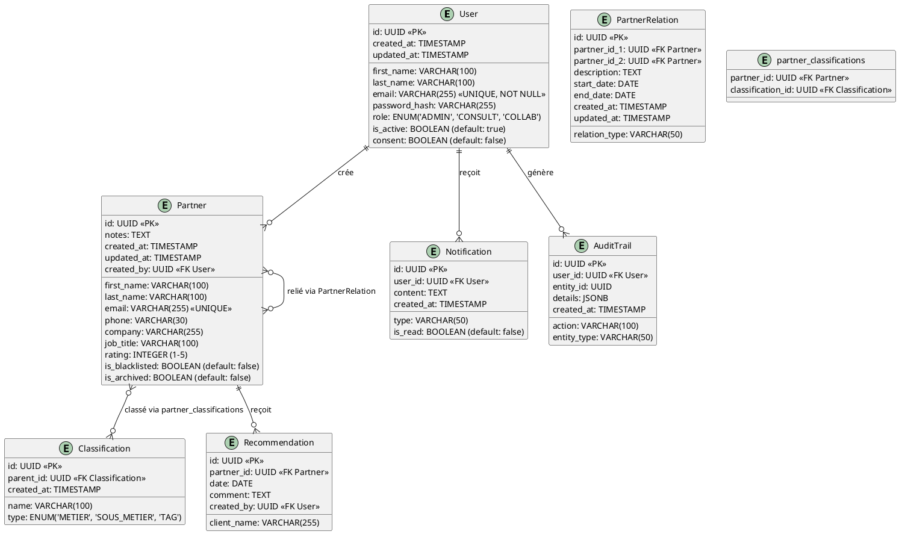

## I. Objectif du projet

Développer une application web de gestion des relations partenaires (PRM) pour structurer, suivre et optimiser les contacts professionnels du cabinet Laurent.

L’outil doit permettre de :

- Organiser efficacement les partenaires
- Retrouver rapidement les bons contacts selon différents critères
- Suivre l’historique des recommandations et des mises en relation
- Améliorer la qualité du réseau et la stratégie de cross-selling/up-selling

---

## II. Spécificités fonctionnelles du projet

### II.1 Compatibilité navigateurs

| Desktop           | Mobile            |
| ----------------- | ----------------- |
| → Google Chrome   | → Google Chrome   |
| → Mozilla Firefox | → Mozilla Firefox |
| → Microsoft Edge  |                   |

### II.2 Rôles utilisateurs (futur)

| Fonctionnalité                    | Administrateur | Consultant | Collaborateur |
| --------------------------------- | :------------: | :--------: | :-----------: |
| Gestion des partenaires           |       ✔️       |     🔒     |      🔒       |
| Consultation des partenaires      |       ✔️       |     ✔️     |      ✔️       |
| Création/modification partenaires |       ✔️       |     🔒     |      🔒       |
| Archivage/blacklist partenaires   |       ✔️       |     🔒     |      🔒       |
| Gestion des classifications       |       ✔️       |     🔒     |      🔒       |
| Consultation des classifications  |       ✔️       |     ✔️     |      ✔️       |
| Statistiques                      |       ✔️       |     🔒     |      ✔️       |
| Notifications                     |       ✔️       |     ✔️     |      ✔️       |
| Scan carte de visite (OCR)        |       ✔️       |     ✔️     |      ✔️       |
| Gestion du profil                 |       ✔️       |     ✔️     |      ✔️       |
| Gestion des utilisateurs          |       ✔️       |     🔒     |      🔒       |

> ✔️ : Accès complet / 🔒 : Accès restreint ou non autorisé

---

## III. Contraintes et exigences fonctionnelles

- Interface web responsive et mobile first adaptée à la consultation et saisie rapide en mobilité
- Interface épurée, professionnelle, avec une navigation intuitive
- Respect des standards d’accessibilité (contrastes, navigation clavier, textes alternatifs)
- Conformité RGPD, chiffrement des données sensibles, gestion des accès par rôles, audit des accès et modifications
- Gestion des accès : authentification forte (OAuth2 via LinkedIn), gestion des sessions, possibilité d’intégration SSO
- Organisation des contacts par métiers, sous-métiers et autres classifications
- Système de notation des partenaires (1 à 5 étoiles), top list et black list
- Historique des recommandations et des mises en relation (clients envoyés/reçus)
- Notifications en cas de changement d’entreprise ou de poste (via LinkedIn)
- Protection des champs personnalisés lors des synchronisations de champ spécifiques
- Fonctionnalité de scan de carte de visite (OCR)
- Application indépendante des autres systèmes informatiques du cabinet
- Suivi des échanges de relations clients entre partenaires
- Prise en compte de la scalabilité et de l’évolutivité de la solution
- Sauvegarde et sécurisation des accès (ex : recommandation d’un coffre-fort numérique pour les mots de passe)

### III.1. Fonctionnalités principales (MVP)

- Gestion des fiches partenaires : création, modification, archivage, classement par catégories et sous-catégories
  - Avocats d’affaires, Fiscalistes, Spécialistes en droit du travail, huissier de justice, banques, compagnies d’affacturage, assureurs, cabinet de gestion de patrimoire, experts en gestion de paie & RH, cabinet de recrutement, notaire
- Champs principaux : nom, prénom, téléphone, email, entreprise, métier/sous-catégorie, commentaires, historique de mises en relation, notation (5 étoiles, blacklist),
- Liens directs téléphone/email
- Recherche et filtres avancés par métier puis par besoin (nom, prénom, sous-catégorie, relation, notation, blacklist…)
- Système de tri croissant, décroissant des filtres
- Suivi des recommandations (clients envoyés/reçus)
- Actions rapides : appel, email
- Interface mobile optimisée pour la saisie rapide
- Sécurité et conformité RGPD

### III.2. Détails du MVP

| Etapes | Pages                                          | Fonctionnalité                                                                                                                                                                                                                       |
| ------ | ---------------------------------------------- | ------------------------------------------------------------------------------------------------------------------------------------------------------------------------------------------------------------------------------------ |
| 1      | Tableau de bord                                | → Accès rapide aux partenaires d’un même métier<br>→ Créer un nouveau partenaire<br>→ Rechercher un partenaire<br>→ Statistiques épurées                                                                                             |
| 2      | Inscription                                    | → Créer son compte principal<br>→ Liens vers la page de connexion                                                                                                                                                                    |
| 3      | Connexion/Déconnexion                          | → Accès sécurisé à ses données<br>→ Récupération de passphrase<br>→ Liens vers la page d’inscription                                                                                                                                 |
| 4      | Partenaire                                     | → Lire, créer, modifier, archiver, blacklister, annoter, noter<br>→ Actions rapides (appel, mailing)<br>→ Lister, créer, modifier, archiver les relations internes                                                                   |
| 5      | Nos partenaires                                | → Créer, modifier un partenaire<br>→ Rechercher/lister, tri croissant/décroissant, filtrer (métier, sous-métier, partenaire avec son réseau interne au cabinet, archive, blacklisting)<br>→ Action groupée (archivage, blacklisting) |
| 6      | Mon compte                                     | → Notifications en temps réel (mail, in-app)<br>→ Mode light/dark(défaut)/système<br>→ Préférences tableau partenaires                                                                                                               |
| 7      | Nos classifications (métier, sous-métier, tag) | → Créer, Modifier, Archiver une classification/métier/sous-métier                                                                                                                                                                    |
| 8      | Contact                                        | → Contacter les développeur                                                                                                                                                                                                          |
| 9      | Police de confidentialité                      | → Consultation <br>→ RGPD                                                                                                                                                                                                            |
| 10     | Sitemap                                        | → Accessibilité de l’architecture de l’application                                                                                                                                                                                   |
| 11     | Mentions légales                               | → Consultation des mentions légales                                                                                                                                                                                                  |

---

### III.3. Fonctionnalités évolutives (post-MVP)

- Statistiques et analyses graphiques d'une part de valeur ajoutée pour un groupe de partenaires
  - Historiques des modifications, notations, micro-réseaux internes
  - Top/flop/dernières notations
  - Plus/moins actifs en interne
  - Plus grand/petit réseau interne
- Restriction d’accès, gestion des droits utilisateurs (admin/consultation/collaboration), choix du rôle sur invitation
- IA pour suggestions et traitement des notes
- Remplissage des fiches partenaires via Linkedin, OCR, signatures email (à terme)
- Notification en cas de changement de poste/entreprise (Api Linkedin)
- Animer l’application avec désactivation (défaut) depuis le paramétrage du compte

### III.4. Fonctionnalités non incluses

- Reconnaissance vocale
- Partage de contacts avec d’autres utilisateurs
- Intégration avec d’autres systèmes (emails, API externes)

---

## IV. Architecture technique recommandée

### IV.1. Stack technologique

- Architecture MVC (**Model View Controler**) avec ORM

#### IV.1.a. **Frontend ReactJS** :

- Framework : **NextJS** (mobile first)
- Architecture CSR (**Client Side Rendering**)
- UI : Tailwind CSS avec séparation du style et du contenu
- Authentification : OAuth2 avec LinkedIn
- Qualité du code : **Oxlint** (linter ultra-rapide), **Commitlint** (conventions de commits), Prettier (formatage)

#### IV.1.b. **Backend NodeJS** :

- Framework **AdonisJS**
- Architecture **API REST** privée
- Sécurité : Auth0, CORS, ORM, validation des entrées, rate limiting, logging, audit OWASP
- Gestion des secrets : stockage sécurisé (variables d’environnement, gestionnaire de secrets), rotation régulière
- Logs d’accès et d’erreur : centralisation, monitoring, alerting (ex : Sentry, Datadog)
- Politique de sauvegarde/restauration : sauvegardes automatiques, tests réguliers de restauration, documentation des procédures
- Méthodologie : TDD (Test Driven Development) avec tests unitaires et d’intégration (Jest, Supertest, ou outils natifs Adonis)

#### IV.1.c. **Base de données** :

- **PostgreSQL** (relationnelle, robuste, adaptée aux besoins de recherche et de structuration)

#### IV.1.d. **APIs externes**

- **OCR** : Intégration d’un service de scan de cartes de visites comme Tesseract.js (open source)
- _Intégrations externes_ :
  - **API LinkedIn** (pour synchronisation et détection des changements de poste, d'entreprise)
  - **API email** (pour récupération de signatures, à terme)

### IV.2 Hébergement & déploiement

- **Hébergement cloud sécurisé** :
  - Vercel (frontend web), Railway (backend)
  - Supabase (base de données managée)
- **CI/CD** :
  - GitHub Actions pour automatiser les tests, le build et le déploiement
- **Environnement de développement** :
  - Conteneurs Docker pour faciliter le développement et le déploiement
- **Migrations de base de données** :
  - AdonisJS Migrations pour gérer les évolutions de la base de données
- **Sauvegardes et monitoring** :
  - Sauvegardes automatiques de la base de données ou manuelles dans le cas d'opérations sensibles

### IV.3 Sécurité

- Chiffrement des données sensibles (au repos et en transit)
- Authentification forte (OAuth2, gestion des rôles)
- Conformité RGPD (droit à l’oubli, consentement)
- Audit des accès et des modifications
- Sécurisation des API (rate limiting, CORS, validation stricte...)

### IV.4. Plan de montée en charge et scalabilité

- Réalisation de tests de charge réguliers (ex : k6, Artillery) pour valider la tenue en charge de l’API et du frontend.
- Mise en place d’un monitoring applicatif (ex : Datadog, Prometheus, Grafana) avec alerting sur seuils critiques.
- Prévoir le scaling horizontal (containers, load balancer) et la documentation des procédures de scaling.
- Documentation des seuils critiques et des plans d’action en cas de saturation.

### IV.5. Analyse critique et optimisations de la stack (Performance & Éco-conception)

#### IV.5.1. Évaluation de la stack actuelle

##### 🟢 Points forts confirmés

- **Next.js 15** : App Router, RSC, optimisations natives (9/10)
- **AdonisJS v6** : TypeScript natif, ORM Lucid performant (8/10)
- **PostgreSQL** : Excellent pour recherches complexes (9/10)
- **Vercel/Railway** : Edge computing, scaling automatique (8/10)

##### 🔴 Optimisations critiques recommandées

| Problème identifié        | Impact             | Solution recommandée           | Gain attendu           |
| ------------------------- | ------------------ | ------------------------------ | ---------------------- |
| **CSR uniquement**        | Performance mobile | Hybrid SSR/CSR avec App Router | -40% temps chargement  |
| **Pas de cache strategy** | Latence API        | Redis + ISR Next.js            | -60% requêtes DB       |
| **OCR côté client**       | Bande passante     | Edge Functions + WebAssembly   | -80% transfert données |
| **Monitoring absent**     | Debugging prod     | Sentry + Vercel Analytics      | +90% détection erreurs |

#### IV.5.2. Recommandations d'optimisation performance

##### Frontend (Next.js)

```typescript
// next.config.js - Configuration éco-responsable
const nextConfig = {
  // Optimisation images automatique
  images: {
    formats: ['image/avif', 'image/webp'],
    minimumCacheTTL: 31536000,
  },
  // Compression maximale
  compress: true,
  // Tree shaking agressif
  experimental: {
    optimizePackageImports: ['@heroicons/react', 'lucide-react'],
  },
  // Service Worker pour cache intelligent
  serviceWorker: {
    scope: '/',
    updateViaCache: 'all',
  },
}
```

##### Backend (AdonisJS)

```typescript
// Configuration base de données optimisée
const database = {
  connection: 'pg',
  connections: {
    pg: {
      // Pool de connexions adapté
      pool: {
        min: 1, // Démarrage minimal
        max: 3, // Maximum pour 1 utilisateur
      },
      // Index optimisés pour recherche
      searchPath: ['public'],
      // Requêtes préparées
      useNullAsDefault: false,
    },
  },
}
```

#### IV.5.3. Stratégie éco-conception spécifique

##### Mesures d'impact environnemental

- **Objectif CO2** : < 1g CO2 par page vue (vs 4.6g moyenne web)
- **Metrics cibles** :
  - First Contentful Paint < 1.2s
  - Bundle size < 150kb
  - Images optimisées automatiquement
  - Lazy loading systématique

##### Architecture verte recommandée

```typescript
// Stratégie de cache multi-niveaux
const cacheStrategy = {
  // Browser cache
  'static-assets': '1y',
  'api-responses': '5m',

  // CDN cache (Vercel Edge)
  'partner-list': '1h',
  classifications: '24h',

  // Server cache (Redis/Memory)
  'search-results': '15m',
  'user-session': '30m',
}
```

#### IV.5.4. Alternatives stack évaluées

| Alternative                  | Performance | Éco-conception | Complexité | Recommandation          |
| ---------------------------- | ----------- | -------------- | ---------- | ----------------------- |
| **SvelteKit + Lucia**        | 9/10        | 9/10           | 7/10       | ❌ Courbe apprentissage |
| **Astro + Node.js**          | 8/10        | 10/10          | 6/10       | ❌ Pas assez interactif |
| **Stack actuelle optimisée** | 9/10        | 8/10           | 5/10       | ✅ **RECOMMANDÉE**      |

#### IV.5.5. Plan d'implémentation optimisée

##### Phase 1 : Optimisations critiques (Semaine 1-2)

- [x] Configuration Next.js hybrid SSR/CSR
- [x] Mise en place Redis pour cache
- [x] Optimisation images et assets
- [x] Service Worker pour cache offline

##### Phase 2 : Monitoring et métriques (Semaine 3-4)

- [x] Intégration Sentry pour monitoring
- [x] Bundle analyzer et optimisation
- [x] Lighthouse CI dans GitHub Actions
- [x] Métriques éco-conception (Website Carbon)

##### Phase 3 : Optimisations avancées (Semaine 5-6)

- [x] Edge Functions pour OCR
- [x] Database connection pooling
- [x] Optimisation requêtes SQL
- [x] Compression images WebP/AVIF

#### IV.5.6. Monitoring environnemental

##### Métriques de suivi recommandées

```typescript
// Dashboard éco-responsabilité
const ecoMetrics = {
  carbonFootprint: '< 1g CO2/page',
  energyUsage: '< 0.5kWh/1000 users',
  dataTransfer: '< 2MB/session',
  cacheHitRatio: '> 85%',
  imageOptimization: '> 90% WebP/AVIF',
}
```

##### Outils de monitoring

- **Website Carbon Calculator** : Mesure empreinte carbone
- **Lighthouse CI** : Performance et éco-conception
- **Bundle Analyzer** : Optimisation du code
- **Vercel Analytics** : Real User Monitoringofessionnels du cabinet Laurent.

### IV.6. Qualité du code et versioning

#### IV.6.1. Linting et formatage

- **Oxlint** : Linter ultra-rapide écrit en Rust, jusqu'à 50x plus rapide qu'ESLint
  - Configuration stricte TypeScript
  - Détection d'erreurs communes React/Next.js
  - Intégration native avec les éditeurs
  - Support des règles ESLint les plus critiques
- **Prettier** : Formatage automatique du code
  - Configuration unifiée pour TS/JS/CSS/MD
  - Intégration Git hooks pour formatage automatique

#### IV.6.2. Conventions de commits

- **Convention Gitmoji + Conventional Commits**
  - Format : `<emoji> <type>: <description>`
  - Exemples : `✨ feat: add partner archiving`, `🐛 fix: correct filter logic`
- **Commitlint** : Validation automatique des messages de commit
  - Règles strictes appliquées via Git hooks
  - Génération automatique de changelog
  - Intégration avec semantic-release pour versioning automatique

#### IV.6.3. Git hooks et workflow

- **Husky** : Gestion des Git hooks
  - `pre-commit` : Oxlint + Prettier sur fichiers modifiés
  - `commit-msg` : Validation Commitlint
  - `pre-push` : Tests unitaires et build
- **lint-staged** : Optimisation des hooks sur fichiers modifiés uniquement

#### IV.6.4. Intégration continue (CI/CD)

- **GitHub Actions** avec vérifications automatiques :
  - Oxlint sur l'ensemble du codebase
  - Tests unitaires et E2E
  - Build et déploiement automatique
  - Génération de rapports de qualité

---

## V. Interface utilisateur

- Design simple, épuré, professionnel, respectant la charte graphique (à définir en juillet)
- Expérience mobile first optimisée pour la saisie rapide

### V.1. Charte graphique

**A definir en juillet 2025**

### V.2. Logo

**A definir en juillet 2025**

### V.3. Gestion UX des notifications d’erreur

- Les messages d’erreur doivent être clairs, non techniques, et affichés de façon non intrusive (toast, alert, inline).
- Chaque action utilisateur doit fournir un feedback visuel en cas d’échec (ex : champ en erreur, message contextuel).
- Les erreurs critiques doivent être loguées côté backend et une notification adaptée doit être affichée côté frontend.

---

## VI. Contraintes & points d’attention

- Scalabilité et évolutivité de la solution
- Sécurité et conformité RGPD
- Simplicité d’utilisation et rapidité de saisie
- Priorité : ne pas perdre de contacts et bien organiser l’information

---

## VIII. Cartographie des routes frontend et backend (optimisée)

Cette section présente la correspondance entre les routes frontend (navigation utilisateur) et backend (API REST), regroupées par grandes catégories fonctionnelles du projet. Elle vise à garantir la cohérence, la maintenabilité et la clarté de l’architecture applicative.

### VIII.1. Tableau des routes frontend

| Catégorie             | URL Frontend       | Description / Page principale         |
| --------------------- | ------------------ | ------------------------------------- |
| Authentification      | /login             | Connexion sécurisée (OAuth2)          |
| Tableau de bord       | /dashboard         | Vue d’ensemble, KPIs, notifications   |
| Partenaires (listing) | /partners          | Liste, recherche, filtres partenaires |
| Partenaire (fiche)    | /partners/:id      | Détail, historique, actions rapides   |
| Partenaire (création) | /partners/new      | Création d’un partenaire              |
| Partenaire (édition)  | /partners/:id/edit | Modification d’un partenaire          |
| Catégories & Tags     | /classifications   | Gestion des classifications (admin)   |
| Utilisateurs          | /users             | Gestion des utilisateurs (admin)      |
| Statistiques          | /stats             | Tableaux de bord, analyses            |
| Notifications         | /notifications     | Liste et détail des notifications     |
| Scan carte de visite  | /scan              | OCR, ajout rapide de contact          |
| Profil utilisateur    | /profile           | Gestion du profil, préférences        |

### VIII.2. Tableau des routes backend

| Catégorie         | Endpoint Backend          | Méthodes HTTP     | Exemple de code routeur (AdonisJS)                                                                                                                                                                                     |
| ----------------- | ------------------------- | ----------------- | ---------------------------------------------------------------------------------------------------------------------------------------------------------------------------------------------------------------------- |
| Auth              | /api/auth/login           | POST              | Route.post('/auth/login', 'AuthController.login')                                                                                                                                                                      |
|                   | /api/auth/logout          | POST              | Route.post('/auth/logout', 'AuthController.logout')                                                                                                                                                                    |
| Utilisateurs      | /api/users                | GET, POST         | Route.get('/users', 'UserController.index')<br>Route.post('/users', 'UserController.store')                                                                                                                            |
|                   | /api/users/:id            | GET, PUT, DELETE  | Route.get('/users/:id', 'UserController.show')<br>Route.put('/users/:id', 'UserController.update')<br>Route.delete('/users/:id', 'UserController.destroy')                                                             |
| Partenaires       | /api/partners             | GET, POST         | Route.get('/partners', 'PartnerController.index')<br>Route.post('/partners', 'PartnerController.store')                                                                                                                |
|                   | /api/partners/:id         | GET, PUT          | Route.get('/partners/:id', 'PartnerController.show')<br>Route.put('/partners/:id', 'PartnerController.update')                                                                                                         |
|                   | /api/partners/:id/archive | PUT               | Route.put('/partners/:id/archive', 'PartnerController.archive')                                                                                                                                                        |
|                   | /api/partners/:id/notes   | POST, PUT, DELETE | Route.post('/partners/:id/notes', 'PartnerController.addNote')<br>Route.put('/partners/:id/notes', 'PartnerController.updateNote')<br>Route.delete('/partners/:id/notes', 'PartnerController.deleteNote')              |
| Catégories & Tags | /api/classifications      | GET, POST         | Route.get('/classifications', 'ClassificationController.index')<br>Route.post('/classifications', 'ClassificationController.store')                                                                                    |
|                   | /api/classifications/:id  | GET, PUT, DELETE  | Route.get('/classifications/:id', 'ClassificationController.show')<br>Route.put('/classifications/:id', 'ClassificationController.update')<br>Route.delete('/classifications/:id', 'ClassificationController.destroy') |
| Statistiques      | /api/stats                | GET               | Route.get('/stats', 'StatsController.index')                                                                                                                                                                           |
| Notifications     | /api/notifications        | GET               | Route.get('/notifications', 'NotificationController.index')                                                                                                                                                            |
|                   | /api/notifications/:id    | PUT               | Route.put('/notifications/:id', 'NotificationController.markAsRead')                                                                                                                                                   |
| OCR/Scan          | /api/scan                 | POST              | Route.post('/scan', 'OcrController.scan')                                                                                                                                                                              |
| LinkedIn Sync     | /api/linkedin/sync        | POST              | Route.post('/linkedin/sync', 'LinkedinController.sync')                                                                                                                                                                |

> Remarque : Par exigence client, la suppression définitive de partenaires n’est pas autorisée. L’archivage (désactivation logique) est réalisé via PUT /api/partners/:id/archive.

---

## VIII.3. Gestion des erreurs et codes HTTP pour l’API

Pour chaque route backend, il est impératif d’implémenter une gestion robuste des erreurs avec des codes HTTP adaptés et des messages explicites. Voici les recommandations :

| Endpoint Backend                | Méthodes HTTP    | Codes d’erreur à prévoir                                                                                               |
| ------------------------------- | ---------------- | ---------------------------------------------------------------------------------------------------------------------- | ------------- |
| /api/auth/login                 | POST             | 400 (données invalides), 401 (identifiants incorrects), 403 (compte désactivé), 500 (erreur serveur)                   |
| /api/auth/logout                | POST             | 401 (non authentifié), 500 (erreur serveur)                                                                            |
| /api/users                      | GET, POST        | 401 (non authentifié), 403 (accès refusé), 400 (données invalides), 409 (conflit email), 500 (erreur serveur)          |
| /api/users/:id                  | GET, PUT, DELETE | 401 (non authentifié), 403 (accès refusé), 404 (utilisateur non trouvé), 400 (données invalides), 500 (erreur serveur) |
| /api/partners                   | GET, POST        | 401, 403, 400, 409 (doublon), 500                                                                                      |
| /api/partners/:id               | GET, PUT         | 401, 403, 404 (partenaire non trouvé), 400, 409 (conflit d’état), 500                                                  |
| /api/partners/:id/archive       | PUT              | 401, 403, 404, 409 (déjà archivé), 500                                                                                 |
| /api/partners/:id/notes         | POST             | 401, 403, 404 (partenaire non trouvé), 400 (note invalide), 500                                                        |
| /api/partners/:id/notes/:noteId | PUT, DELETE      | 401, 403, 404 (note non trouvée), 400, 500                                                                             |
| /api/classifications            | GET, POST        | 401, 403, 400, 409 (classification existante), 500                                                                     |
| /api/classifications/:id        | GET, PUT, DELETE | 401, 403, 404 (classification non trouvée), 400, 500                                                                   |
| Statistiques                    | /api/stats       | GET                                                                                                                    | 401, 403, 500 |
| /api/notifications              | GET              | 401, 403, 500                                                                                                          |
| /api/notifications/:id          | PUT              | 401, 403, 404 (notification non trouvée), 500                                                                          |
| /api/scan                       | POST             | 401, 400 (fichier invalide), 422 (format non supporté), 500                                                            |
| /api/linkedin/sync              | POST             | 401, 400, 422 (erreur LinkedIn), 500                                                                                   |

**Exemples de messages d’erreur à retourner :**

- 400 : « Données invalides », « Format email invalide »
- 401 : « Authentification requise »
- 403 : « Accès refusé »
- 404 : « Ressource non trouvée »
- 409 : « Conflit : ressource déjà existante ou état incompatible »
- 422 : « Entité non traitable »
- 500 : « Erreur interne du serveur »

**Recommandations :**

- Centraliser la gestion des erreurs dans des exceptions personnalisées (AdonisJS).
- Documenter chaque route avec les codes d’erreur possibles et les messages associés.

---

## VIII.4. Documentation API (Swagger / OpenAPI)

L’API backend doit être documentée de façon exhaustive et maintenue à jour à l’aide d’un standard ouvert : **Swagger (OpenAPI)**. Cette documentation doit :

- Décrire chaque endpoint, ses paramètres, ses codes de réponse et exemples de payloads (requête et réponse).
- Lister tous les cas d’erreur possibles pour chaque route.
- Documenter les endpoints de maintenance (statut, healthcheck, etc.).
- Être accessible pour les développeurs et les parties prenantes (ex : via Swagger UI).
- Être générée automatiquement à partir du code ou maintenue dans le dépôt backend.

**Exemple de payload (POST /api/partners)**

```json
{
  "first_name": "Jean",
  "last_name": "Dupont",
  "email": "jean.dupont@exemple.com",
  "company": "Cabinet Laurent",
  "classifications": ["Avocat d’affaires", "Fiscaliste"]
}
```

**Exemple de réponse (201 Created)**

```json
{
  "id": "uuid",
  "first_name": "Jean",
  "last_name": "Dupont",
  "email": "jean.dupont@exemple.com",
  "company": "Cabinet Laurent",
  "classifications": ["Avocat d’affaires", "Fiscaliste"],
  "created_at": "2025-06-16T12:00:00Z"
}
```

---

## IX. Architecture des dossiers frontend et backend

Architecture par feature, mutualisation des éléments transverses dans `shared/`, tests au plus près du code métier, conventions de nommage strictes.

### IX.1. Frontend (React / Next.js)

```
/frontend
│
├── public/                  # Fichiers statiques (favicon, images, robots.txt)
├── src/
│   ├── features/
│   │   ├── partners/
│   │   │   ├── components/      # Composants UI spécifiques à la feature
│   │   │   ├── hooks/           # Hooks React spécifiques à la feature
│   │   │   ├── services/        # Appels API, logique métier de la feature
│   │   │   ├── pages/           # Pages Next.js liées à la feature
│   │   │   ├── types/           # Types/DTO/interfaces spécifiques
│   │   │   ├── tests/           # Tests unitaires/intégration de la feature
│   │   │   └── styles/          # Styles spécifiques (module.css, tailwind, etc.)
│   │   ├── users/
│   │   ├── categories/
│   │   ├── notifications/
│   │   ├── stats/
│   │   └── ...
│   ├── shared/               # Composants, hooks, utils réutilisables (transverses)
│   ├── layouts/              # Layouts globaux
│   ├── contexts/             # Contexts React globaux
│   ├── config/               # Configurations globales
│   ├── middlewares/          # Middlewares Next.js
│   └── types/                # Types globaux
├── e2e/                      # Tests end-to-end Playwright (scénarios utilisateurs)
│   ├── tests/
│   └── fixtures/
├── .env.local
├── tailwind.config.js
├── next.config.js
├── tsconfig.json
├── jest.config.js
├── oxlint.json
├── .prettierrc
├── .prettierignore
├── commitlint.config.js
├── .husky/
├── .github/
│   └── workflows/
```

### IX.2. Backend (AdonisJS)

```
/backend
│
├── app/
│   ├── features/
│   │   ├── partners/
│   │   │   ├── controllers/      # Contrôleurs HTTP de la feature
│   │   │   ├── services/         # Services métier de la feature
│   │   │   ├── validators/       # Validation des requêtes
│   │   │   ├── models/           # Modèles ORM spécifiques
│   │   │   ├── tests/            # Tests unitaires/fonctionnels de la feature
│   │   │   └── ...
│   │   ├── users/
│   │   ├── categories/
│   │   ├── notifications/
│   │   ├── stats/
│   │   └── ...
│   ├── shared/                   # Middlewares, helpers, exceptions communs
│   ├── contracts/                # Interfaces et types globaux
│   └── ...
├── tests/                        # Tests globaux si besoin
├── e2e/                          # Tests end-to-end Playwright (API, parcours complets)
│   ├── tests/
│   └── fixtures/
├── config/
├── database/
│   ├── migrations/
│   ├── seeders/
│   └── factories/
├── public/
├── start/
│   ├── routes.ts
│   └── kernel.ts
├── .env
├── ace
├── package.json
├── tsconfig.json
├── jest.config.js
├── oxlint.json
├── .prettierrc
├── .prettierignore
├── commitlint.config.js
├── .husky/
├── .github/
│   └── workflows/
```

**Bonnes pratiques :**

- Chaque feature est autonome et isolée, facilitant le refactoring, l’onboarding et la gestion des tests.
- Les tests (unitaires, intégration, E2E) sont placés au plus près du code métier de chaque feature.
- Les éléments transverses (UI, hooks, helpers, middlewares, types globaux) sont centralisés dans `shared/`.
- Les conventions de nommage, de commit et de structure restent identiques à celles définies précédemment.
- La CI/CD, le lint, le formatage et les hooks Git s’appliquent à l’ensemble du projet, quelle que soit la structure.

---

## X. Conventions de nommage et de commits

### X.1 Conventions de nommage des commits

Pour garantir un historique Git lisible, homogène et exploitable, le projet adopte la convention suivante :

- **Préfixe Gitmoji** : chaque commit commence par un emoji Gitmoji décrivant le type de changement (voir https://gitmoji.dev/)
- **Préfixe conventionnel** : suivi d’un mot-clé (fix, feat, chore, docs, refactor, test, ci, style, perf, build, revert)
- **Message court et explicite**

**Exemples :**

- :sparkles: feat: add partner archiving endpoint
- :bug: fix: correct partner list filter logic
- :recycle: refactor: extract user service
- :memo: docs: update API documentation
- :white_check_mark: test: add e2e test for login
- :rocket: ci: add GitHub Actions workflow for backend

**Tableau de correspondance** :

| Gitmoji               | Préfixe  | Description                         |
| --------------------- | -------- | ----------------------------------- |
| :sparkles:            | feat     | Nouvelle fonctionnalité             |
| :bug:                 | fix      | Correction de bug                   |
| :recycle:             | refactor | Refactoring (sans ajout de feature) |
| :memo:                | docs     | Documentation                       |
| :white_check_mark:    | test     | Ajout/modif de tests                |
| :rocket:              | ci       | Intégration continue (CI/CD)        |
| :art:                 | style    | Formatage, indentation, etc.        |
| :zap:                 | perf     | Amélioration de performance         |
| :package:             | build    | Build, dépendances, versionning     |
| :rewind:              | revert   | Annulation de commit                |
| :construction_worker: | chore    | Tâches annexes (config, scripts)    |

**Bonnes pratiques :**

- Toujours utiliser un Gitmoji + préfixe.
- Rédiger le message en anglais, à l’impératif, court et précis.
- Utiliser Commitlint pour valider la convention.

### X.2 Conventions de nommage du code

Pour garantir la lisibilité, la maintenabilité et la cohérence du code sur l’ensemble du projet (frontend Next.js, backend AdonisJS), appliquer les conventions suivantes :

| Élément        | Convention       | Exemple                        |
| -------------- | ---------------- | ------------------------------ |
| Variable       | camelCase        | partnerList, userId            |
| Fonction       | camelCase        | getPartnerById(), fetchUsers() |
| Classe         | PascalCase       | PartnerController, UserService |
| Interface/Type | PascalCase       | PartnerDTO, UserRole           |
| Enum           | PascalCase       | PartnerStatus, UserType        |
| Fichier        | kebab-case       | partner-controller.ts          |
| Dossier        | kebab-case       | user-services/                 |
| Constante      | UPPER_SNAKE_CASE | API_URL, MAX_PARTNERS          |

**Règles complémentaires :**

- Toujours nommer en anglais (sauf exceptions métiers justifiées).
- Les noms doivent être explicites, éviter les abréviations non standards.
- Les fonctions doivent être des verbes ou des verbes + complément (ex : fetchData, updateUserProfile).
- Les classes, types et interfaces doivent être des noms ou groupes nominaux (ex : PartnerController, UserDTO).
- Les fichiers et dossiers doivent être en kebab-case, courts et explicites.
- Les constantes globales en UPPER_SNAKE_CASE.
- Respecter les conventions TypeScript/JavaScript de la communauté.

**Exemples :**

```ts
// Variable
const partnerList = [];

// Fonction
function fetchPartners() { ... }

// Classe
class PartnerController { ... }

// Interface
interface PartnerDTO { ... }

// Enum
enum PartnerStatus { ACTIVE, ARCHIVED }

// Constante
const API_URL = 'https://api.example.com';
```

Ces conventions sont à appliquer strictement sur l’ensemble du code, des tests, des scripts et de la documentation technique.

---

## XI. Users stories principales du MVP

| Prio | User story (format agile) | Je veux…                                                                                 | Afin de …                                                   | Valeur métier / Bénéfice                                | Critères d’acceptation principaux                                                                                                                                                                   | Sous-tâches techniques / Points d’attention                 |
| ---- | ------------------------- | ---------------------------------------------------------------------------------------- | ----------------------------------------------------------- | ------------------------------------------------------- | --------------------------------------------------------------------------------------------------------------------------------------------------------------------------------------------------- | ----------------------------------------------------------- |
| 1    | Administrateur            | Créer, modifier, archiver, et consulter des fiches partenaires                           | Organiser efficacement le réseau professionnel du cabinet   | Structuration, traçabilité, centralisation des contacts | Saisie de tous les champs, archivage sans suppression, accès à l’historique des modifications, skeleton loader pour les données dynamiques, **aucune donnée sensible en clair, audit trail activé** | Validation des champs, gestion archivage, audit trail, RGPD |
| 2    | Consultant                | Rechercher et filtrer les partenaires selon différents critères                          | Retrouver rapidement le bon contact                         | Gain de temps, efficacité opérationnelle                | Recherche par nom, métier, entreprise, tags, notation, blacklist, résultats rapides                                                                                                                 | Indexation recherche, UI/UX filtres avancés                 |
| 5    | Utilisateur               | Recevoir des notifications en cas de changement de poste ou d’entreprise d’un partenaire | Maintenir à jour mon réseau                                 | Réactivité, fiabilité des données                       | Notification in-app/email, lien direct vers la fiche concernée                                                                                                                                      | Intégration API LinkedIn, système de notification           |
| 6    | Utilisateur               | Accéder à des actions rapides (appeler, email, LinkedIn) depuis la fiche partenaire      | Faciliter les interactions                                  | Productivité, simplicité d’usage                        | Boutons d’action visibles, actions fonctionnelles sur mobile et desktop                                                                                                                             | UI actions rapides, responsive                              |
| 7    | Collaborateur             | Annoter, noter et blacklister un partenaire                                              | Qualifier la relation et optimiser le suivi                 | Qualité du réseau, suivi personnalisé                   | Ajout/modif de notes, notation 1-5 étoiles, blacklist, gestion des droits                                                                                                                           | UI notation/blacklist, gestion droits                       |
| 8    | Administrateur            | Garantir la sécurité et la conformité RGPD des données partenaires                       | Protéger les informations sensibles                         | Confiance, respect légal                                | Chiffrement, droit à l’oubli, consentement, sauvegardes automatiques                                                                                                                                | Implémentation chiffrement, gestion consentement, backup    |
| 9    | Utilisateur               | Bénéficier d’une interface mobile first, épurée et accessible                            | Pouvoir utiliser l’application en mobilité et sans friction | Adoption, efficacité, accessibilité                     | Respect accessibilité, temps de chargement < 2s, responsive design, **conformité WCAG, navigation clavier**                                                                                         | UI/UX mobile first, optimisation performance                |

---

## XII. Modélisation UML de la base de données

La modélisation de la base de données repose sur une approche relationnelle robuste, conforme aux exigences de sécurité, de scalabilité et de conformité RGPD. Voici la description exhaustive :

### 1. Diagramme de classes UML (notation textuelle)



### 2. Description des entités principales

- **User** : Utilisateur de l’application (admin, consultant, collaborateur). Email unique, consentement RGPD, rôle, statut actif.
- **Partner** : Partenaire référencé. Informations de contact, statut (archivé, blacklisté), rating, historique, créé par un User.
- **Classification** : Catégorie, sous-catégorie ou tag métier. Hiérarchie possible via parent_id, typage par enum, jointure n,n avec Partner.
- **Recommendation** : Historique des recommandations faites par un partenaire à un client.
- **Notification** : Alertes et notifications pour les utilisateurs.
- **AuditTrail** : Historique des actions sensibles pour la traçabilité RGPD.
- **PartnerRelation** : Relations entre partenaires (collaboration, co-traitance, etc.).
- **partner_classifications** : Table de jointure n,n entre Partner et Classification.

### 3. Détail des relations et contraintes

- **User–Partner** : 1,n (un utilisateur peut créer plusieurs partenaires).
- **Partner–Classification** : n,n via partner_classifications (un partenaire peut avoir plusieurs classifications et inversement).
- **Partner–Recommendation** : 1,n (un partenaire reçoit plusieurs recommandations).
- **User–Notification** : 1,n (un utilisateur reçoit plusieurs notifications).
- **User–AuditTrail** : 1,n (un utilisateur génère plusieurs entrées d’audit).
- **Partner–Partner** : n,n via PartnerRelation (relations multiples entre partenaires).
- **Contraintes d’intégrité** :
  - Unicité sur email (User, Partner)
  - Suppression en cascade désactivée (archivage logique)
  - Historisation de toutes les actions sensibles (AuditTrail)
  - Chiffrement des données sensibles côté application
  - Consentement RGPD stocké dans User

### 4. Points clés pour la sécurité, la conformité RGPD, la scalabilité et l’évolutivité

- **Sécurité** : UUID pour toutes les PK, chiffrement des données sensibles, audit trail, gestion des accès par rôle.
- **RGPD** : Consentement explicite, droit à l’oubli (archivage logique), audit des accès et modifications.
- **Scalabilité** : Index sur les champs de recherche, tables de jointure pour flexibilité, architecture modulaire.
- **Évolutivité** : Enum pour les rôles, relations n,n, ajout facile de nouvelles entités ou attributs.
